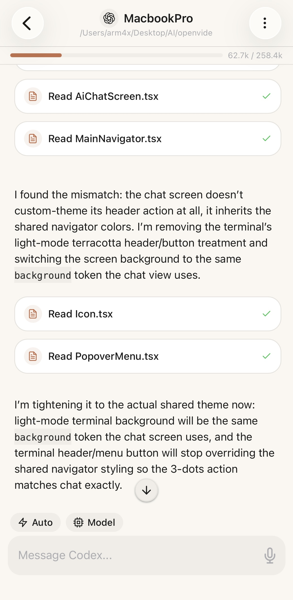
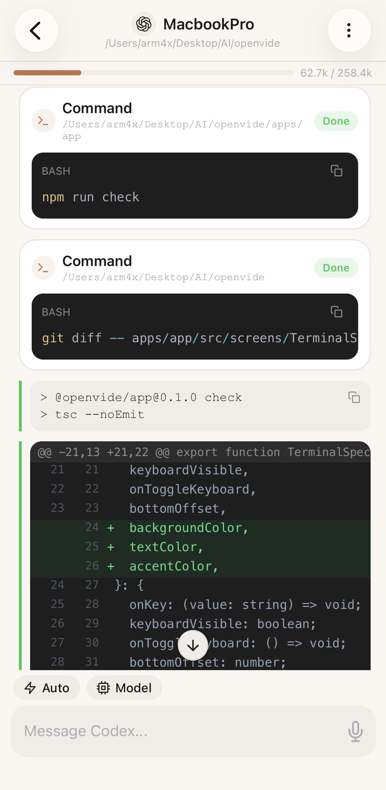
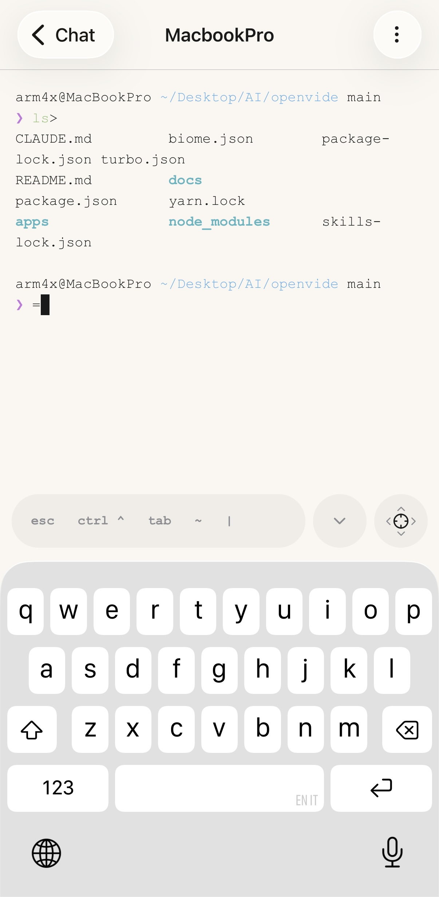

<p align="center">
  
</p>

<h1 align="center">OpenVide</h1>

<p align="center">
  Chat-first remote control for Codex, Claude Code, and soon Gemini on any server.
</p>

<p align="center">
  Run AI coding agents over SSH from your phone, keep sessions alive on the host, and switch between chat, diffs, terminal, and file browsing without leaving the app.
</p>

<p align="center">
  
  
  <a href="./LICENSE"></a>
  
  
</p>

<p align="center">
  <strong>Remote hosts</strong> | <strong>Chat UX</strong> | <strong>Diff viewer</strong> | <strong>Terminal</strong> | <strong>File browser</strong>
</p>

<p align="center">
  
  
  
</p>

OpenVide is a React Native mobile app for running AI coding CLIs on remote machines over SSH. A lightweight daemon runs on each host to relay commands and persist sessions so work survives reconnects, backgrounding, and network drops.

## What the App Does

- **Connect** to remote hosts over SSH (password or key-based auth)
- **Detect** which AI CLIs are installed on the host (Claude, Codex, Gemini)
- **Install, update, or remove** supported CLIs directly from the app
- **Run multi-turn AI sessions** — send prompts, stream output live, resume conversations
- **Persist sessions** on the remote host so work isn't lost when you disconnect
- **Push notifications** when sessions complete (even if the app is killed)
- **Store credentials securely** on-device (SSH keys via expo-secure-store)

## Prerequisites

- **Node.js** >= 18
- **Yarn** 4 (the repo uses Corepack — run `corepack enable` if needed)
- **EAS CLI** for cloud builds: `npm install -g eas-cli`
- **Xcode** (iOS) or **Android Studio** (Android) for local builds
- An **Expo account** (free) at [expo.dev](https://expo.dev)

## Quick Start

```bash
git clone https://github.com/open-vide/openvide.git
cd openvide
yarn install
```

Then follow the setup steps below to configure your local environment before building.

## Project Structure

```
openvide/
  apps/
    app/              React Native mobile app (Expo SDK 54)
    daemon/           openvide-daemon (Node.js relay, runs on remote machines)
  package.json        Yarn workspaces + Turborepo root
```

## Setup

Several files are gitignored because they contain personal identifiers (bundle IDs, EAS project IDs, Firebase keys). You need to create them before building.

### 1. Variant configs

The app supports two build variants: `production` and `development`. Each needs a `config.json` with your own bundle identifiers.

```bash
cd apps/app

# Copy the example configs
cp variants/production/config.example.json variants/production/config.json
cp variants/development/config.example.json variants/development/config.json
```

Edit each `config.json` with your values:

```json
{
  "displayName": "OpenVide",
  "iosBundleIdentifier": "com.yourorg.openvide",
  "androidPackage": "com.yourorg.openvide",
  "scheme": "openvide",
  "splashBackgroundColor": "#FFFFFF"
}
```

You also need to provide icon and splash assets for each variant:
- `variants/production/icon.png` (1024x1024 app icon)
- `variants/production/splash.png` (splash screen image)
- `variants/production/splash-animation.json` (Lottie animation for animated splash)
- Same for `variants/development/`

### 2. Environment file

```bash
cp apps/app/.env.example apps/app/.env
```

Edit `apps/app/.env`:

```env
# Apple Development Team ID (required for iOS builds)
APP_DEVELOPMENT_TEAM=YOUR_TEAM_ID

# EAS project ID (fallback — prefer app.json, see step 3)
EXPO_PROJECT_ID=

# Set to "1" to enable push notifications on iOS (requires paid Apple Developer account).
# Leave unset for free/personal accounts — the app builds and works without push.
# Android push is enabled automatically when google-services.json is present.
# ENABLE_PUSH_NOTIFICATIONS=1
```

Find your Apple Team ID in Xcode → Settings → Accounts, or at [developer.apple.com](https://developer.apple.com).

### 3. EAS project link

The app uses EAS (Expo Application Services) for cloud builds, OTA updates, and push notifications. Each contributor needs their own EAS project.

```bash
cd apps/app

# Create or link an EAS project (select your account/org when prompted)
eas init
```

This creates `apps/app/app.json` with your project's `owner`, `name`, `slug`, and `projectId`. This file is gitignored — see `app.json.example` for the format.

If `eas init` fails to write to the dynamic config, create `app.json` manually:

```json
{
  "expo": {
    "owner": "your-expo-username-or-org",
    "name": "Your App Name",
    "slug": "your-app-slug",
    "extra": {
      "eas": {
        "projectId": "your-eas-project-id"
      }
    }
  }
}
```

### 4. Push notifications (optional)

Push notifications are **entirely optional**. The app builds and works without them. Skip this step if you don't need notifications when sessions complete.

**Android** — requires Firebase Cloud Messaging:

1. Create a project at [Firebase Console](https://console.firebase.google.com)
2. Add Android apps with your package names (e.g. `com.yourorg.openvide` and `com.yourorg.openvide.dev`)
3. Download `google-services.json` and place it at `apps/app/google-services.json`
4. In Firebase → Project Settings → Service accounts → **Generate new private key** (downloads a JSON file)
5. Upload the service account key to your Expo project:
   ```bash
   cd apps/app
   eas credentials --platform android
   # Select your build profile → Push Notifications → FCM V1 → upload the JSON
   ```

Android push is enabled automatically when `google-services.json` is present. Without it, builds succeed normally — push just won't work.

**iOS** — requires a paid Apple Developer account:

Free/personal Apple Developer accounts don't support the Push Notifications capability, so it's **disabled by default**. To enable it, set in your `.env`:

```env
ENABLE_PUSH_NOTIFICATIONS=1
```

Then prebuild:

```bash
ENABLE_PUSH_NOTIFICATIONS=1 yarn prebuild:clean
```

Without this flag, the push entitlement is stripped from iOS builds so they work on any Apple Developer account.

## Build the App

### Local builds (recommended for development)

Requires Xcode (iOS) or Android Studio (Android) installed locally.

```bash
cd apps/app

# Generate native projects
yarn prebuild:clean            # production variant
yarn prebuild:dev:clean        # development variant

# Run on device/simulator
yarn ios                       # iOS (production)
yarn ios:dev                   # iOS (development)
yarn android                   # Android (production)
yarn android:dev               # Android (development)

# Start Metro bundler (if not auto-started)
yarn start
```

### Cloud builds (EAS)

Builds are submitted to Expo's build service. No local Xcode/Android Studio required.

```bash
cd apps/app

# Android (outputs .apk for dev/preview, .aab for production)
yarn build:dev                 # development client
yarn build:preview             # internal testing
yarn build:prod                # production

# iOS
yarn build:dev:ios
yarn build:preview:ios
yarn build:prod:ios
```

### OTA updates

Push JavaScript bundle updates to devices without a full rebuild:

```bash
cd apps/app
yarn update:dev                # development channel
yarn update:preview            # preview channel
yarn update:prod               # production channel
```

## Build the Daemon

The daemon runs on each remote machine you want to control. It needs Node.js >= 18.

```bash
# From the repo root
yarn install
yarn daemon:build
```

Build output is in `apps/daemon/dist`. To install globally on a remote machine:

```bash
cd apps/daemon && npm install -g .
openvide-daemon health   # auto-starts the daemon and returns status
```

The app can also install the daemon for you — go to a host's detail screen and tap "Install Daemon".

## How the App Works

The app never talks to CLI tools directly. Instead, it communicates with the daemon on each remote machine over SSH:

```
Mobile App → SSH exec → openvide-daemon CLI → Unix socket IPC → Daemon process
                                                                   ↓
                                                             spawns CLI tool
                                                          (claude / codex / gemini)
                                                                   ↓
                                                          stdout/stderr captured
                                                          line-by-line → output.jsonl
                                                                   ↓
App ← SSH stdout ← openvide-daemon session stream --follow ← tails output.jsonl
```

1. The app opens an SSH connection to your host and runs `openvide-daemon` commands.
2. Sessions are created per workspace and tool, then prompts are sent to the daemon.
3. The daemon spawns the CLI tool, captures output line-by-line into JSONL files.
4. The app tails streamed output over SSH and renders parsed events in a chat-like UI.
5. For multi-turn conversations, the daemon tracks conversation IDs (`session_id` for Claude, `thread_id` for Codex) and passes them back on subsequent turns.

## How the Daemon Works

The daemon (`openvide-daemon`) is a zero-dependency Node.js process that runs persistently on each remote machine.

- **Self-daemonizes**: auto-starts on first CLI invocation, no manual setup needed.
- **No open ports**: communicates only via a local Unix domain socket (`~/.openvide-daemon/daemon.sock`). All app-to-daemon communication goes through CLI commands executed over SSH.
- **Persistent state**: sessions, output logs, and metadata live in `~/.openvide-daemon/`.
- **Heartbeat**: PID file is touched every 30s; considered stale after 60s.
- **Graceful shutdown**: sends SIGTERM to child processes, SIGKILL after 5s timeout.

### IPC Commands

| Command | Description |
|---------|-------------|
| `session.create` | Create a session record and output directory |
| `session.send` | Spawn the CLI tool process, begin capturing output |
| `session.stream --follow` | Tail output.jsonl in real-time (reads file directly, bypasses IPC) |
| `session.cancel` | SIGINT → 3s grace → SIGTERM |
| `session.get/list/remove` | CRUD on session records |
| `config set-push-token` | Register Expo push token for notifications |
| `health` | PID, uptime, session counts |
| `stop` | Graceful shutdown |

### Output Format (output.jsonl)

Each line is one of three types:
- `{ t: "o", ts, line }` — stdout from the CLI tool
- `{ t: "e", ts, line }` — stderr from the CLI tool
- `{ t: "m", ts, event, ... }` — meta events: `turn_start`, `turn_end` (with exit code), `error`

## TypeScript Check

```bash
# From repo root — checks both app and daemon
yarn check
```

## Troubleshooting

**`expo prebuild` fails with missing variant config**
You haven't created `variants/production/config.json` (or `development`). Copy from the `.example.json` files — see [Setup step 1](#1-variant-configs).

**`eas build` fails with "Cannot automatically write to dynamic config"**
Create `apps/app/app.json` manually — see [Setup step 3](#3-eas-project-link).

**`eas build` fails with Yarn/Corepack version error**
The `eas.json` sets `COREPACK_ENABLE_STRICT=0` to handle this. If you still hit issues, make sure you're using the latest EAS CLI: `npm install -g eas-cli@latest`.

**iOS build fails with "Personal development teams do not support Push Notifications"**
Make sure `ENABLE_PUSH_NOTIFICATIONS` is **not** set in your `.env` (or is empty). By default, push is disabled on iOS so free/personal accounts can build. See [Setup step 4](#4-push-notifications-optional).

**Push notifications return "InvalidCredentials"**
The FCM V1 Service Account Key is missing or uploaded to the wrong EAS project. Run `eas credentials --platform android` and check that FCM V1 is set up under the correct application identifier (matching your `androidPackage` in the variant config).
